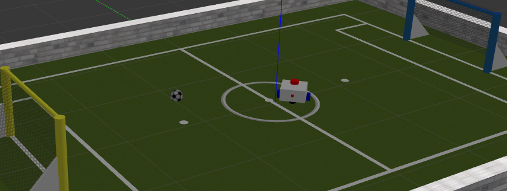
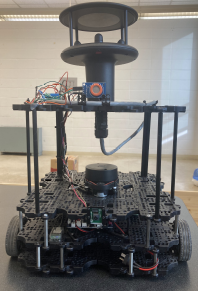

# Robot Navigation

We want to develop a robot navigation algorithm that can process robot's sensor data to generate robot navigation commands to fulfill the given objective.

For this toy problem, we have a differential driver robot with the following sensors:
- Camera (with depth sensing)
- Laser distance sensing

Objective: we want to write a program that can guide the robot to score goals!

Environments:

We can first develop our algorithm in a simulation environment:  


And then test the algorithm in real world.  


For simulation, we need:
- Robot operaing system environment
- Gazebo simulation environment

## Setting up Robot Operating System Envrionment

Robot Operating System (ROS) requires specific versions of Ubuntu. For example, ROS 2 Humble require Ubuntu 22.04. We can use Visual Studio Code dev container to setup ROS environment in a wide variety of operating systems. For this we need:
- Visual Studio Code
- Docker engine

### Install Visual Studio Code
Use app store, or visit [Download Visual Studio Code](https://code.visualstudio.com/download).

### Install docker engine
#### Ubuntu
Find Install using the convenience script from [Install Docker Engine on Ubuntu](https://docs.docker.com/engine/install/ubuntu/). In your terminal, execute
```
curl -fsSL https://get.docker.com -o get-docker.sh
sudo sh ./get-docker.sh
```

[Post installation steps](https://docs.docker.com/engine/install/linux-postinstall/)

```
sudo groupadd docker
sudo usermod -aG docker $USER
```
Then reboot your pc.

### Setup ROS Container

- You need to install Visual Studio Code's **Remote Development** extension. Click on the Extension tab, search for Remote Development, install.
- Create a new directory (folder) called `my_bot` in a suitable place.
- Open the folder in Visual Studio Code.
- At the bottom-left corner you will find a blue button, click it > Select Reopen in container > Add configuration to workspace > Show All Templates ... > Type ROS > Select ROS (ijnek) > Select humble > desktop-full > Search for and select extensions: 'Lightweight Desktop' > keep defaults and wait for the setup to finish.

Please don't add PyThon or Anaconda extensions.

### 
Open a terminal and execute the following commands:

```bash
cd my_bot && mkdir src
git clone https://github.com/SunzidHassan/my_bot.git
cd my_bot
colcon build --symlink-install
source install/setup.bash
ros2 launch my_bot launch_sim.launch.py world:=./src/my_bot/worlds/football.world
```
Wait for the simulation to start. Then open a new terminal and execute the following commands:
```bash
cd my_bot
source install/setup.bash
ros2 run teleop_twist_keyboard teleop_twist_keyboard
```
You can now drive the robot in the simulated environment.

To observe the sensor readings, open a new terminal and execute:
```bash
rviz2 -d src/my_bot/config/view_bot.rviz
```

## Controlling the robot
Open a new terminal and execute:
```bash
ros2 run my_bot_controller my_bot_subpub
```

You'll find the robot has started to move automatically. You can also find some informative output in the terminal.

In your vscode editor, open the file: my_bot>src>my_bot_controller>my_bot_controller>my_bot_subpub.py

In lines 84, 85, you'll file the lines:
```python
msg.linear.x = 0.01
msg.angular.z = 0.05
```
Change the values (stay within 0-1). Stop the program my_bot_subpub by pressing `ctrl+c` and run it again. Notice any changes in robot's movement?
